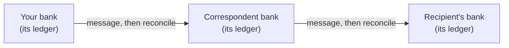
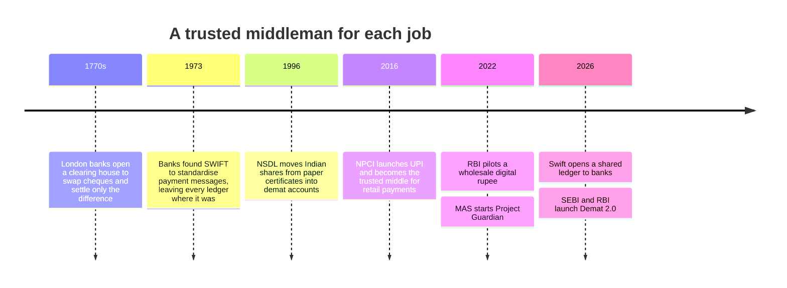

Paying for chai with UPI takes about two seconds. Selling shares through a broker in India puts the money in your bank account the next working day. Sending money to a parent in another country can take anywhere from an hour to several days, and on average about 6% of a \$200 transfer is lost to fees and exchange-rate markups, according to the [World Bank](https://remittanceprices.worldbank.org/).

All three are the same act. A number in one account goes down and a number in another account goes up. The difference in speed and cost has little to do with distance or computers. It comes from how many separate record-keepers have to agree that the money moved.

<figure class="chart">
<svg viewBox="0 0 640 240" role="img" aria-labelledby="cost-title cost-desc">
<title id="cost-title">What it costs to send $200</title>
<desc id="cost-desc">UPI transfers within India are free for consumers. Sending $200 abroad costs 4.59% through digital services, 6.36% on global average and 7.30% through cash-based services, against a G20 and UN target of 3% by 2030.</desc>
<text class="label" x="0" y="16" font-weight="600">Cost of sending $200, as a share of the amount</text>
<line class="grid" x1="210" y1="34" x2="210" y2="202"/>
<line class="grid" x1="307.5" y1="34" x2="307.5" y2="202"/>
<line class="grid" x1="405" y1="34" x2="405" y2="202"/>
<line class="grid" x1="502.5" y1="34" x2="502.5" y2="202"/>
<line class="grid" x1="600" y1="34" x2="600" y2="202"/>
<text class="label" x="200" y="59" text-anchor="end">UPI transfer within India</text>
<text class="value" x="216" y="59">Free</text>
<text class="label" x="200" y="103" text-anchor="end">Digital remittance services</text>
<path class="mark" d="M210,88 h219.8 a4,4 0 0 1 4,4 v14 a4,4 0 0 1 -4,4 h-219.8 Z"><title>Digital remittance services: 4.59%</title></path>
<text class="value" x="442" y="103">4.6%</text>
<text class="label" x="200" y="147" text-anchor="end">Global average</text>
<path class="mark" d="M210,132 h306.1 a4,4 0 0 1 4,4 v14 a4,4 0 0 1 -4,4 h-306.1 Z"><title>Global average: 6.36%</title></path>
<text class="value" x="528" y="147">6.4%</text>
<text class="label" x="200" y="191" text-anchor="end">Cash-based services</text>
<path class="mark" d="M210,176 h351.9 a4,4 0 0 1 4,4 v14 a4,4 0 0 1 -4,4 h-351.9 Z"><title>Cash-based services: 7.30%</title></path>
<text class="value" x="574" y="191">7.3%</text>
<line class="ref" x1="356.25" y1="34" x2="356.25" y2="202"/>
<text class="muted" x="362" y="44">G20 and UN target for 2030: 3%</text>
<text class="muted" x="210" y="222" text-anchor="middle">0%</text>
<text class="muted" x="307.5" y="222" text-anchor="middle">2%</text>
<text class="muted" x="405" y="222" text-anchor="middle">4%</text>
<text class="muted" x="502.5" y="222" text-anchor="middle">6%</text>
<text class="muted" x="600" y="222" text-anchor="middle">8%</text>
</svg>
<figcaption>Fees plus exchange-rate markup on a $200 transfer, Q3 2025. Source: <a href="https://remittanceprices.worldbank.org/">World Bank Remittance Prices Worldwide</a> UPI stays free for consumers, and person-to-person transfers carry no charge. From 15 October 2026, merchants pay a Merchant Discount Rate (MDR) of 0.4% on UPI payments above ₹2,000, capped at ₹300 a transaction. Payments up to ₹2,000 and small merchants receiving up to ₹1 lakh a month stay at zero, and merchants cannot pass the charge on to customers. Source: <a href="https://financialservices.gov.in/sites/default/files/2026-09/FAQs---Merchant-Discount-Rate--MDR--on-Select-UPI--P2M--Transactions_0.pdf">NPCI MDR FAQs</a></figcaption>
</figure>

## Every institution keeps its own books

Your bank balance is an entry in your bank's ledger. Your broker keeps a ledger of the shares you own, the depository keeps another, and the exchange's clearing corporation keeps a third. None of them can see or write to the others' books.

When money or an asset moves between two institutions, each one updates its own record and sends messages to confirm that the other did the same. Someone then has to check that the records match. Finance calls this reconciliation, and every bank, custodian and fund house runs a back office for it. When two records disagree, people chase the difference by email and phone until they find it.

A cross-border payment shows the problem at its worst. An Indian bank usually has no account with a small bank in another country, so the payment travels through one or more correspondent banks that hold accounts with both. Each hop adds its own ledger, messages, compliance checks and fee, and loses a day if it falls on a weekend or public holiday in either country.

A payment sent abroad today:

The same payment on a shared ledger:

Even UPI only looks instant. Your phone confirms in seconds because both banks update their customers' accounts straight away. The banks then pay each other in batches, several times a day, on a net basis through their accounts at the Reserve Bank of India ([NPCI](https://www.npci.org.in/PDF/npci/others/UPI-Settlement-Process.pdf)). The reconciliation still happens. UPI hides it well because a single operator, NPCI, sits in the middle and every bank accepts its record of who owes whom.

## Why this was not fixed long ago

The obvious fix is one shared record that every institution reads and writes, leaving nothing to reconcile. The obstacle has always been deciding who holds it. Banks compete with each other, and none will let a rival keep the master copy of its customers' money. Countries feel the same way about each other's institutions.

For about 250 years the answer has been to appoint a trusted middleman and give it the master copy for one narrow job.

Each of these worked inside its own boundary. A depository covers one country's securities. UPI covers one country's rupee payments, with links to other countries negotiated one at a time. Cross-border payments still pass along chains of correspondent banks because no global operator exists that every country and bank would trust.

Shared-ledger technology changed one thing. Over the past decade it has become practical to run a single record that many institutions update together, with the rules about who can write what enforced by software and cryptography instead of by one operator's word. Every participant can verify that nobody has altered the record. The same record can hold both the asset and the money, so both sides of a trade move at the same instant or neither moves. Finance calls this atomic settlement, and it removes the risk that one side pays and the other never delivers.

A shared ledger does not make anything fast by itself, and UPI proves you can be fast without one. Its use is narrower: many institutions that do not fully trust each other need to agree on the same record, and no single operator exists that all of them would accept. That describes most of cross-border finance and much of the bond market.

## Where it is being tried

The early movers are central banks, market infrastructure and large banks, working mostly with assets that institutions trade among themselves.

| Initiative | Where | What moves on it | Status, October 2026 |
|---|---|---|---|
| [Demat 2.0](https://www.theblock.co/news/regulation/2026-09-11-indias-sebi-demat-2-0-pilot-debuts-with-over-100-million-in-tokenized-bonds-414252) | India: SEBI and RBI | Corporate bonds issued directly on a shared ledger and paid for in wholesale digital rupees | Pilot launched 10 September 2026. REC, L&T and IIFL Finance raised ₹1,025 crore |
| [Wholesale e-rupee](https://rbi.org.in/Scripts/BS_PressReleaseDisplay.aspx?prid=54616) | India: RBI | Settlement of government bond trades between banks | Pilot since 1 November 2022 with nine banks |
| [Project Guardian](https://www.mas.gov.sg/schemes-and-initiatives/project-guardian) | Singapore: MAS | Tokenised bonds, funds, foreign exchange and repo | More than 40 institutions since 2022 |
| [Project Ensemble](https://www.hkma.gov.hk/eng/news-and-media/press-releases/2025/11/20251113-3/) | Hong Kong: HKMA | Tokenised bank deposits used to buy tokenised money market funds | Real-money pilot running through 2026 |
| [Swift shared ledger](https://www.theblock.co/post/407687/swift-launches-blockchain-ledger-for-tokenized-deposit-pilot-with-17-banks) | 17 banks including DBS, OCBC, UOB, HSBC and Citi | Tokenised bank deposits for cross-border payments, around the clock | Live since 9 July 2026 |
| [Kinexys](https://www.dlnews.com/articles/markets/jpmorgan-expands-digital-assets-push-with-mitsubishi-deal-as-it-targets-dollar10bn-in-daily-transactions/) by JPMorgan | Global | Payments and repo between institutional clients | About \$5 billion a day as of March 2026 |
| [BUIDL](https://app.rwa.xyz/treasuries) by BlackRock | Global | Shares in a US Treasury money market fund | Launched March 2024, one of the largest tokenised Treasury funds |

Swift's entry says the most about direction. Swift built the messaging network that let every bank keep its own books for fifty years, and it now runs a shared ledger for its member banks. In India, the regulator that oversaw the move from paper shares to demat is building the next version with the central bank.

The amounts are still small next to the markets they sit in. Indian corporate bonds outstanding total about ₹61 lakh crore, according to [SEBI's chairman](https://www.businesstoday.in/markets/story/corporate-bonds-hit-rs61-lakh-crore-sebi-pushes-for-deeper-and-more-liquid-debt-markets-557148-2026-09-23) in September 2026, so Demat 2.0's first ₹1,025 crore is under 0.02% of the market. Growth is fast all the same. US government debt held on public shared ledgers rose from about \$100 million at the start of 2023 to almost \$15 billion in October 2026.

<figure class="chart">
<svg viewBox="0 0 640 250" role="img" aria-labelledby="tt-title tt-desc">
<title id="tt-title">Tokenised US Treasuries, 2023 to 2026</title>
<desc id="tt-desc">Value of US Treasury products recorded on public shared ledgers: about $0.1 billion in January 2023, $1.1 billion in March 2024, just under $4 billion in January 2025, $8.9 billion in January 2026 and $14.8 billion in October 2026.</desc>
<text class="label" x="0" y="16" font-weight="600">Tokenised US Treasuries, value in US dollars</text>
<line class="grid" x1="60" y1="210" x2="600" y2="210"/>
<line class="grid" x1="60" y1="165" x2="600" y2="165"/>
<line class="grid" x1="60" y1="120" x2="600" y2="120"/>
<line class="grid" x1="60" y1="75" x2="600" y2="75"/>
<line class="grid" x1="60" y1="30" x2="600" y2="30"/>
<text class="muted" x="50" y="214" text-anchor="end">$0</text>
<text class="muted" x="50" y="169" text-anchor="end">$4B</text>
<text class="muted" x="50" y="124" text-anchor="end">$8B</text>
<text class="muted" x="50" y="79" text-anchor="end">$12B</text>
<text class="muted" x="50" y="34" text-anchor="end">$16B</text>
<polyline class="line" points="60,208.8 217.5,197.9 330,166.1 465,109.9 566.3,43.5"/>
<circle class="dot" cx="60" cy="208.8" r="5"><title>January 2023: about $0.1 billion</title></circle>
<circle class="dot" cx="217.5" cy="197.9" r="5"><title>March 2024: $1.08 billion</title></circle>
<circle class="dot" cx="330" cy="166.1" r="5"><title>January 2025: just under $4 billion</title></circle>
<circle class="dot" cx="465" cy="109.9" r="5"><title>January 2026: $8.9 billion</title></circle>
<circle class="dot" cx="566.3" cy="43.5" r="5"><title>October 2026: $14.8 billion</title></circle>
<text class="value" x="70" y="196">$0.1B</text>
<text class="value" x="556" y="34" text-anchor="end">$14.8B</text>
<text class="muted" x="60" y="232" text-anchor="middle">2023</text>
<text class="muted" x="195" y="232" text-anchor="middle">2024</text>
<text class="muted" x="330" y="232" text-anchor="middle">2025</text>
<text class="muted" x="465" y="232" text-anchor="middle">2026</text>
</svg>
<figcaption>Sources: <a href="https://www.coindesk.com/markets/2024/03/28/over-1b-in-us-treasury-notes-has-been-tokenized-on-public-blockchains">CoinDesk</a> for January 2023 and March 2024; <a href="https://cointelegraph.com/news/tokenized-us-treasurys-rise-1b-2026">Cointelegraph citing RWA.xyz</a> for January 2025 and January 2026; <a href="https://app.rwa.xyz/treasuries">RWA.xyz</a> for October 2026.</figcaption>
</figure>

## What to expect

Most people will never knowingly use a shared ledger. They will notice the effects instead: a bond trade where the bond and the payment change hands in the same instant, or money to family abroad that arrives in minutes on a Sunday. The plumbing will stay as invisible as NPCI is to most UPI users.

Institutions will move first, and among themselves. Bond issuance, fund shares, repo and payments between banks come before anything retail, because the parties are few, regulated and already know each other. The G20 wants three in four cross-border payments to reach the recipient within an hour by the end of 2027, and the [Financial Stability Board](https://www.fsb.org/2025/10/g20-roadmap-for-cross-border-payments-consolidated-progress-report-for-2025/) says that target will probably be missed.

In Asia, regulators are leading. MAS, HKMA, RBI and SEBI designed the pilots above and chose who takes part. That makes adoption slower and more permissioned than in crypto markets, and more likely to last.

The open question is whether these ledgers will connect. A Singapore network, a Hong Kong network and an Indian network that cannot exchange assets with each other would rebuild today's chain of correspondent banks one layer up. Whether they interoperate, and whether they run on public networks or stay private, will decide how much of the promise above arrives.

I track these pilots and the regulation around them every week at [The Monsoon Ledger](https://themonsoonledger.com/).
